# GoPub - Academic Publishing Platform

GoPub is a modern web-based academic publishing platform built with Laravel. It allows users to publish, search, and manage academic publications with role-based access control.

## Features

- User authentication and authorization
- Role-based access (Admin, Publisher, User)
- Publication management (create, edit, delete, view)
- Advanced search with auto-suggestions
- User management for administrators
- Responsive design with modern UI/UX
- Publication analytics (views, downloads)
- File upload support

## User Roles

### Admin
- Manage all users and publications
- Create, edit, delete users
- Full system access
- View system analytics

### Publisher
- Create and manage own publications
- Edit publication status
- View publication analytics

### User
- View and search publications
- Download publications
- Basic profile management

## Screenshots

### Home Page (Guest)
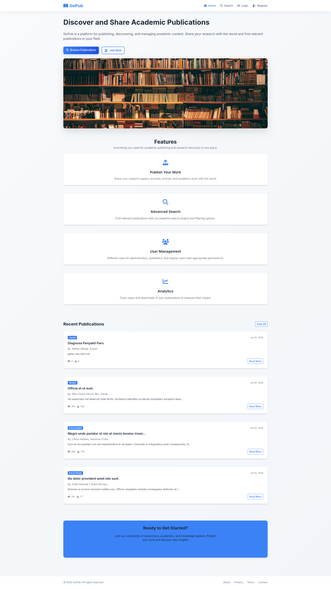

### Login Page
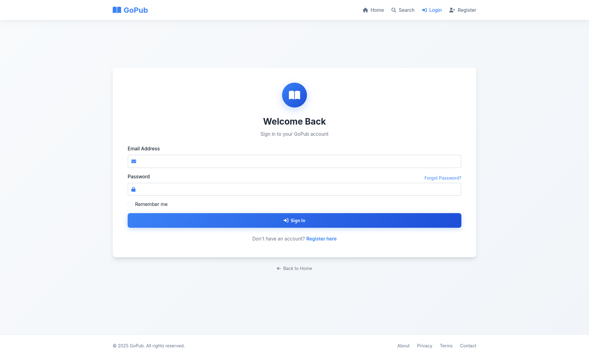

### Register Page
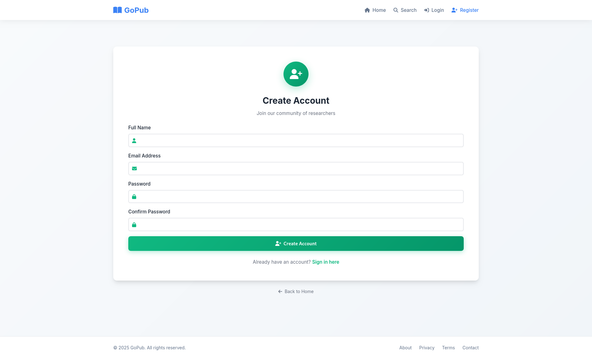

### Admin Dashboard
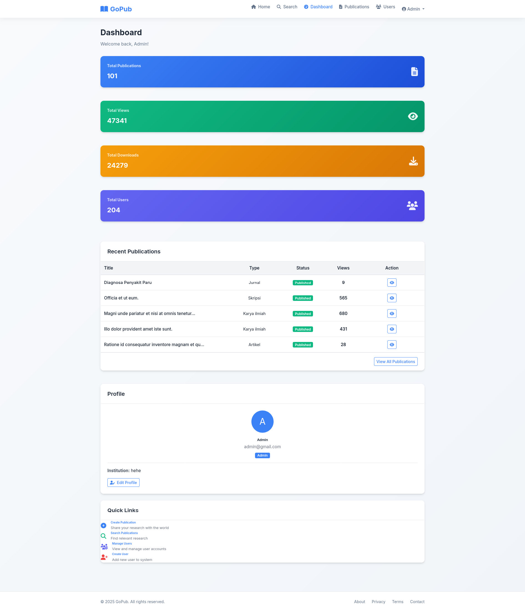

### Publisher Dashboard


### User Dashboard
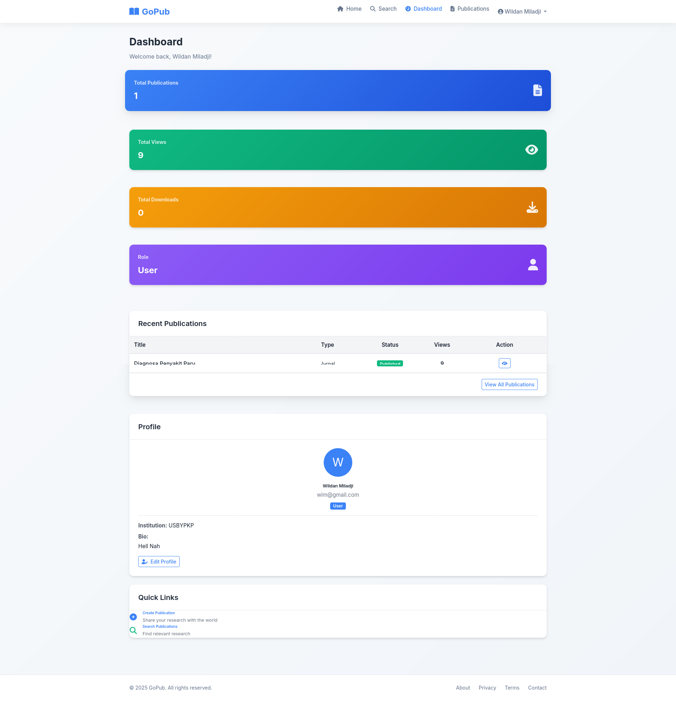

### Manage Publications
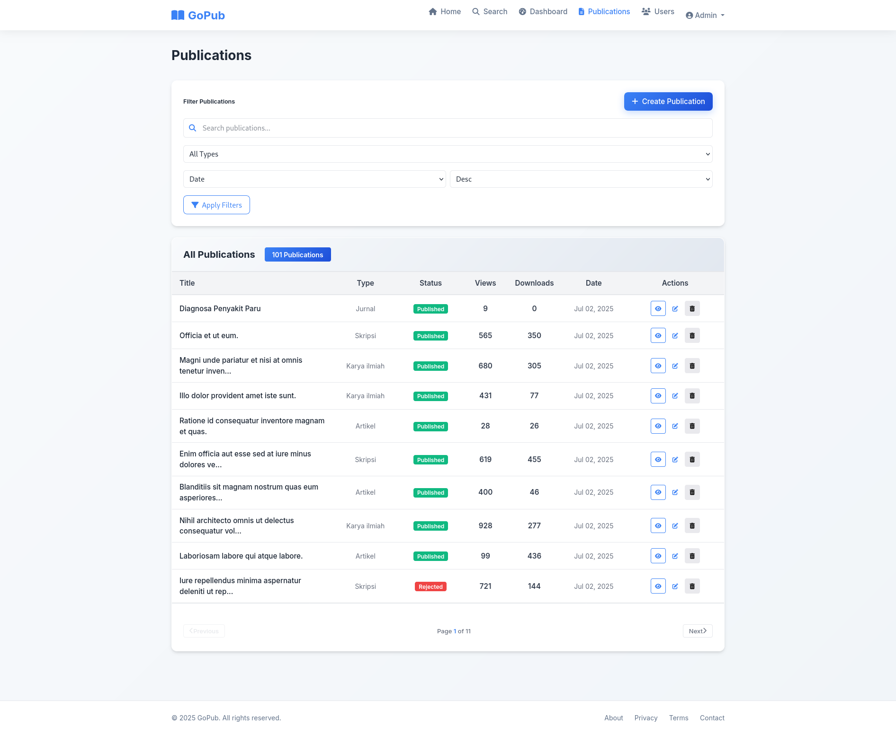

### Manage Users (Admin)
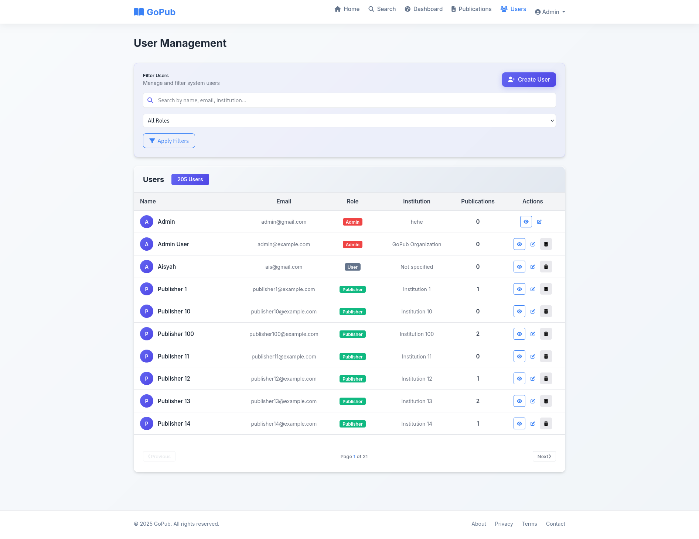

### Upload Publication
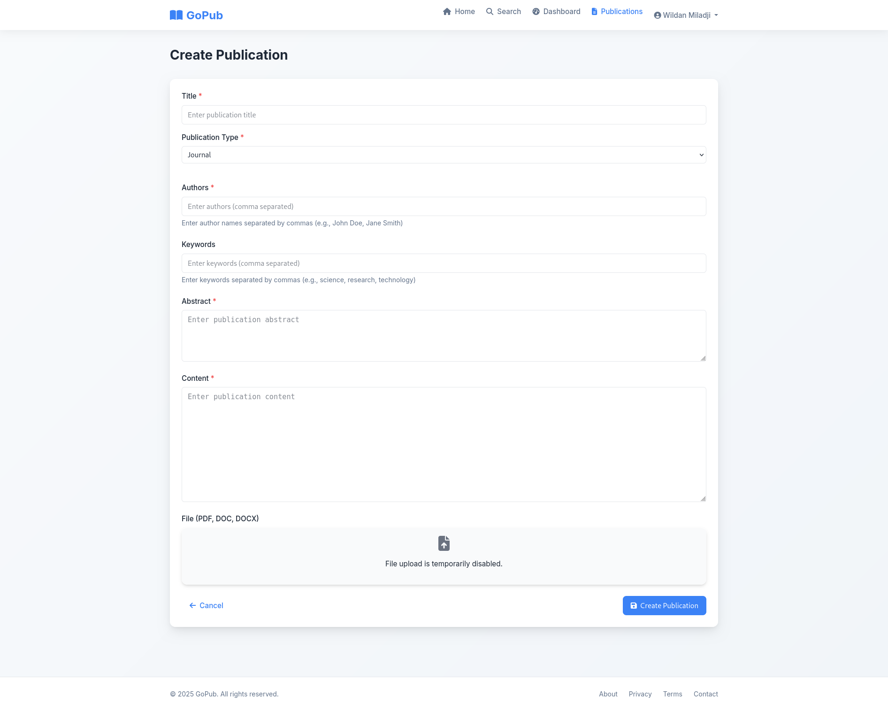

### Publication Detail
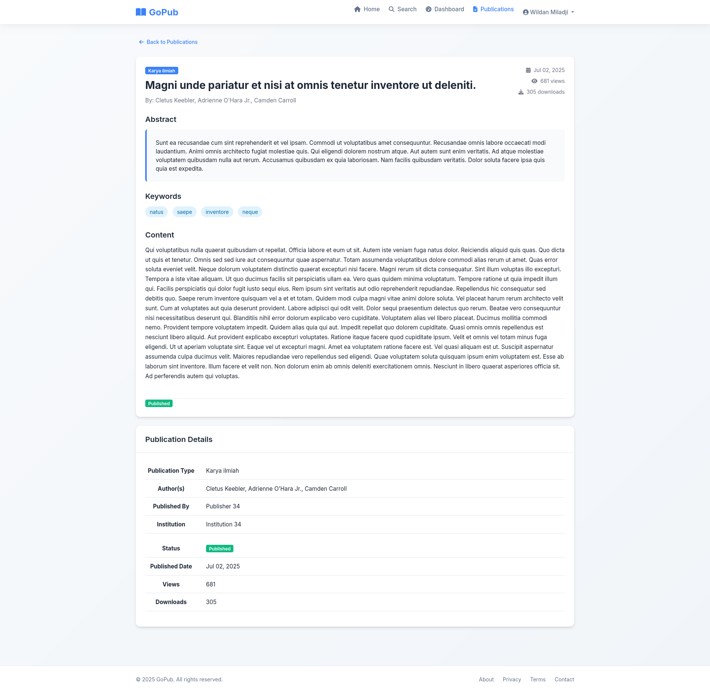

### Search Page
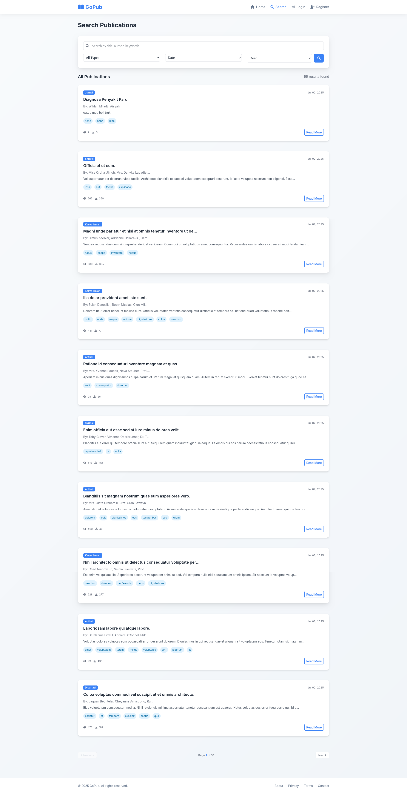

### User Profile
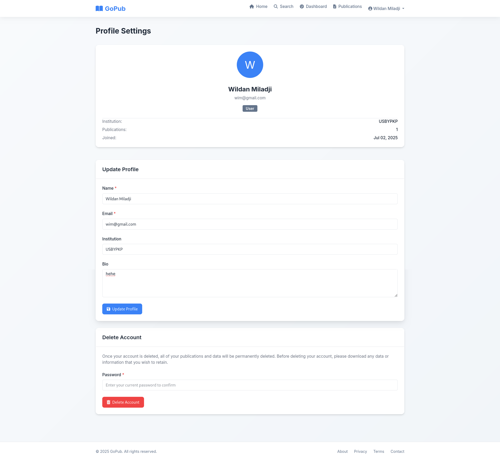

## Installation

### Requirements
- PHP 8.1 or higher
- Composer
- MySQL/MariaDB
- Node.js and NPM

### Setup Instructions

1. Clone the repository
```bash
git clone https://github.com/WiMProject/gopub.git
cd gopub
```

2. Install PHP dependencies
```bash
composer install
```

3. Install Node.js dependencies
```bash
npm install
```

4. Copy environment file
```bash
cp .env.example .env
```

5. Configure database in .env file
```
DB_CONNECTION=mysql
DB_HOST=127.0.0.1
DB_PORT=3306
DB_DATABASE=gopub
DB_USERNAME=your_username
DB_PASSWORD=your_password
```

6. Generate application key
```bash
php artisan key:generate
```

7. Run database migrations
```bash
php artisan migrate
```

8. Seed the database
```bash
php artisan db:seed
```

9. Create storage link
```bash
php artisan storage:link
```

10. Build assets
```bash
npm run build
```

11. Start the development server
```bash
php artisan serve
```

The application will be available at http://localhost:8000

## Default Users

After seeding, you can login with these accounts:

### Admin
- Email: admin@gopub.com
- Password: password

### Publisher
- Email: publisher@gopub.com
- Password: password

### User
- Email: user@gopub.com
- Password: password

## Usage

### For Publishers
1. Login with publisher account
2. Go to Publications menu
3. Click "Create Publication"
4. Fill in publication details
5. Submit for review

### For Admins
1. Login with admin account
2. Manage users from Users menu
3. Approve/reject publications
4. View system analytics

### For Users
1. Register or login
2. Browse publications
3. Use search with filters
4. Download publications

## Technology Stack

- Backend: Laravel 11
- Frontend: Blade Templates, Bootstrap
- Database: MySQL
- Authentication: Laravel Breeze
- File Storage: Local Storage
- Search: MySQL Full-Text Search

## Developer

Created by Wildan Miladji (WIM)

## License

This project is open-sourced software licensed under the MIT license.